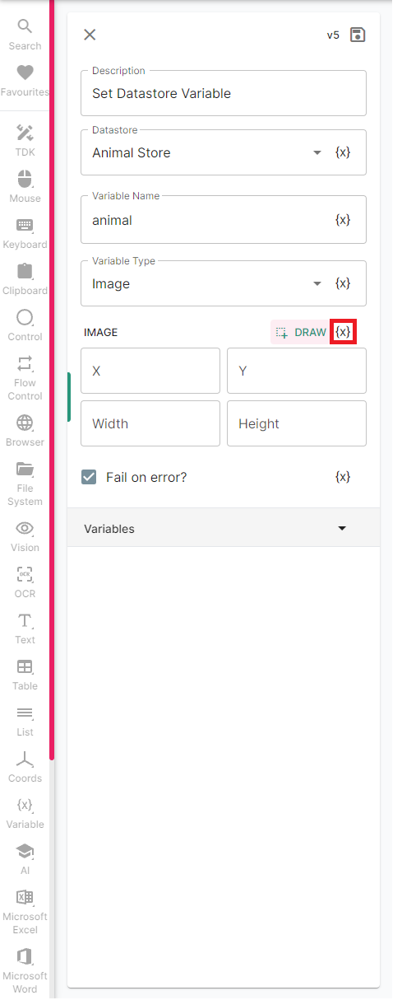

# Using Actions

To get an image of our favourite animal, we'll use a number of Actions:

1. **Browser &gt; Open Browser** - Open a browser to Google.
2. **Browser &gt; Get Web Element** - Find the search box and click it to enter our animal.
3. **Keyboard &gt; Text Input** - Type our animal into the search box.
4. **Keyboard &gt; Key Input** - Hit Enter to search for the animal.
5. **Browser &gt; Get Web Element** - Find the "Images" tab and click it.
6. **Vision &gt; Capture Screen** - take a screenshot \(this will serve as our picture\).
7. **Variable &gt; Datastore Variable** - Save the image to our datastore.

Try to replicate Actions 1-6 using the screenshots below!

The image above shows our inputs for Actions 1 - 6 - for now, we've set the _**Text Input**_ action to always search for "honeybadger" - at the the end we'll change this when we stitch everything together. Below, we can see what our sequence of actions looks like:

Lastly, it's time for Action 7 - we'll save the image to our datastore so that it can be accessed by our app. Find the _Set Datastore Variable_ action under _Variable:_

Fill in the fields above as shown, using the dropdown for "Datastore" to select the "Animal Store" we created earlier. We're creating a variable within our Datastore called _animal._ Now, we just need to tell our Bot where to source the image from. To do this, we need to select the {x} \(outlined in red above\) to grab a _**Datachip**_ ****- an output from a previous action. Clicking {x} drops our current action down to display the previous actions:

Click the "Capture Screen" card to flip it over, then click on the "image" Datachip to link it to the "Set Datastore Variable". Nice! Save everything, and hit "Start Activity".

If everything went smoothly, the console at the bottom of the Activity Designer shouldn't have any red warning-esque messages.

That's it! Let's navigate back to our Datastore to check our image is there.

Beautiful! To finish off, let's connect everything together using a Workflow.

